<a name="readme"/>

# 

**Quester** is a Fullstack application written in Java/Spring Boot 
(Backend-part) and HTML/CSS/JavaScript (Frontend-part), a web service that allows
to create, view, share and play text games. The service has an elaborate
functionality aimed at client-friendliness and social interaction between users.
Particular attention was paid to security and data integrity, flexible
architecture, simple and clean code, as well as the ease of support. The project
is covered by unit/integration tests and documented.

Based on a considerable number of business logic requirements, in order to avoid
unnecessary complexity and internal inconsistency, in the process of the
development were considered the advantages and disadvantages of different
approaches to designing the application architecture and ORM model, and were
chosen solutions that were regarded as the most justified in the context of the
application.

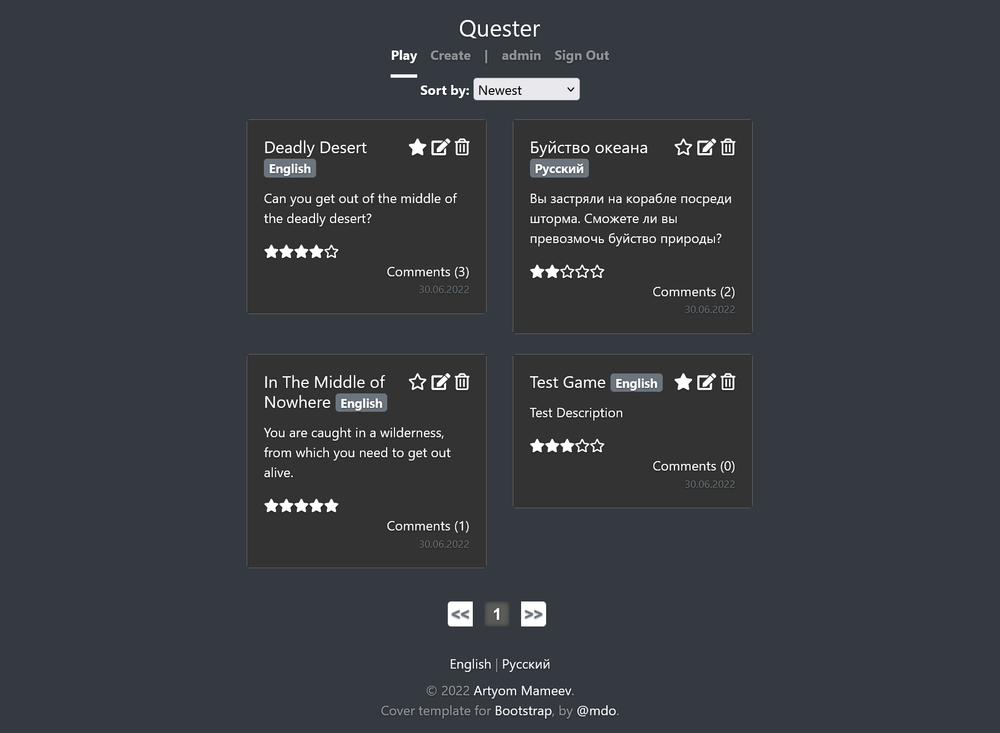

## Table of Contents

[How it works](#how-it-works)  
[Features](#features)  
[Architecture](#architecture)  
[Code style](#style)  
[Data storage](#data)  
[Text games format](#textgame)  
[Getting started](#getting-started)  
[TODO](#todo)  
[License](#license)  
[Contribution](#contribution)

<a name="how-it-works"/>

## How it works

The backend is written in Java, the main backend technology stack:

- [Spring Boot](https://spring.io/projects/spring-boot) for autoconfiguration
  and dependency injection;
- [Spring MVC](https://docs.spring.io/spring-framework/docs/3.2.x/spring-framework-reference/html/mvc.html)
  for handling HTML requests to the server;
- [Spring Security](https://spring.io/projects/spring-security) for
  authentication, authorization, and protection from unauthorized access;
- [Spring Data JPA](https://spring.io/projects/spring-data-jpa) for storing and
  accessing data;
- [Spring AOP](https://docs.spring.io/spring-framework/docs/2.5.x/reference/aop.html)
  to separate cross-cutting functionality;
- [Java Bean Validation](https://beanvalidation.org) for user input validation;
- [Thymeleaf](https://www.thymeleaf.org) to generate dynamic HTML;
- [Jackson](https://github.com/FasterXML/jackson) for JSON
  serialization/deserialization;
- [Lombok](https://projectlombok.org) to avoid boilerplate code;
- [WebJars](https://www.webjars.org) for adding JavaScript dependencies directly
  to the project;
- [JUnit](https://junit.org/junit5/) for writing unit/integration tests;
- [Mockito](https://site.mockito.org)
  /[Powermock](https://github.com/powermock/powermock) for creating mock objects
  in unit/integration tests;
- [EqualsVerifier](https://jqno.nl/equalsverifier/) to test the `equals()`
  and `hashCode()` methods.

The frontend is written in HTML/CSS and JavaScript, the main frontend technology
stack:

- [Bootstrap](https://getbootstrap.com) for user interface components;
- [Popper](https://popper.js.org) for the functionality of Bootstrap modal
  windows;
- [jQuery](https://jquery.com) for handling and manipulating DOM elements and
  working with AJAX;
- [jsTree](https://www.jstree.com) for implementing an interactive tree in the
  game constructor;
- [luckmoshypagnation.js](https://www.jqueryscript.net/other/luckmoshy-bootstrap-pagination.html)
  for pagination implementation;
- [jQuery Rating.js](https://github.com/timyboy12345/Rating.js) for rating
  system implementation;
- [Shareon.js](https://github.com/kytta/shareon) for social media buttons;
- [Font Awesome](https://fontawesome.com/) for some icons;
- [JavaScript Cookie](https://github.com/js-cookie/js-cookie) to handle AJAX
  under Spring Security's built-in CSRF protection;
- [Jest](https://jestjs.io/ru/) to write unit tests for JavaScript code;
- [LiveReload](https://docs.spring.io/spring-boot/docs/1.5.16.RELEASE/reference/html/using-boot-devtools.html#using-boot-devtools-livereload)
  to automatically reload web pages when code/resources change during
  development.

Maven is used for automatic building of the project.  
H2 in-memory database is used as a database.

<a name="features"/>

## Features

- A simple user interface using cards and modal windows, which alerts the user
  about errors, warns about the possible irreversibility of operations and
  informs about the successful completion of actions, the result of which is not
  obvious;
- Users can use the basic functionality of the service without registration;
- Possibility of both standard registration, and login with Google, using the
  oAuth2 technology;
- Use of RememberMe technology;
- Users can edit their registration data;
- Full-fledged text games constructor with a simple interface that allows the
  users to create and edit game elements;
- Users can save games for private access only and publish or hide them from
  public access;
- Users can view a list of their own hidden games with pagination, and
  individually test them;
- Users can edit and delete their own and others' (for administrators) games;
- Multilanguage support - at the moment the English and Russian localization is
  fully available, between which the user can switch directly on the fly, it is
  also possible to create games in different languages;
- Users can view the list of all released games with sorting by date of creation
  or rating, with basic information about each game and basic actions, as well
  as pagination;
- Users can rate games, for each game is calculated a global rating;
- Users can write comments to the games;
- Users can edit and delete their own or others' (for administrators) comments;
- Users can play any published games;
- Users can receive any published games via API in JSON format for possible
  implementation of third-party clients;
- Users can add games to favorites list;
- Users can view their own favorites list, sorted by creation date or rating,
  with basic information about each game and basic actions, as well as
  pagination;
- Individual pages for each game with detailed information and actions, as well
  as social media buttons;
- Users can see a basic information about any user, including user's rating 
  (calculated from the rating of games created by the user), the number of games
  created, the number of games rated, the number of comments posted;
- Users can see a list of all games created by a particular user, sorted by date
  of creation or rating, with basic information about each game and basic
  actions, as well as pagination;
- Users can see a list of all comments created by a specific user, with
  pagination;
- Admins can block a specific user or delete all their games, ratings or
  comments;
- Protection against unauthorized access with Spring Security technologies,
  stock protection against CSRF attacks.

[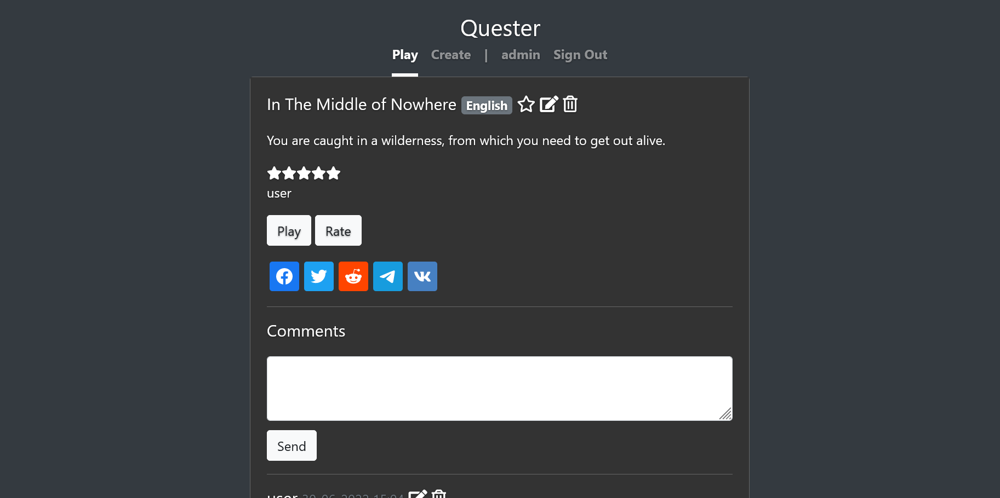](https://github.com/artyom-mameev/quester/blob/master/readme/screenshots/2-for-preview-1-full.png?raw=true) [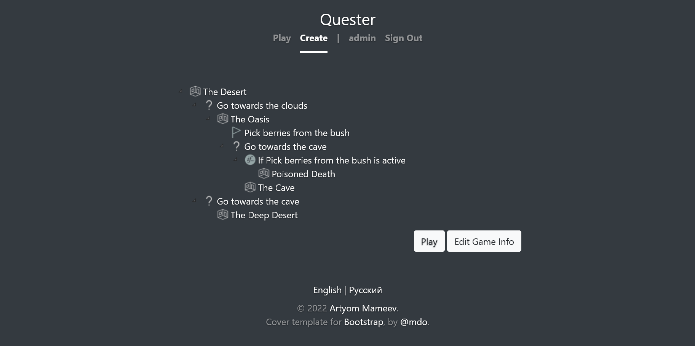](https://github.com/artyom-mameev/quester/blob/master/readme/screenshots/2-for-preview-2-full.png?raw=true) [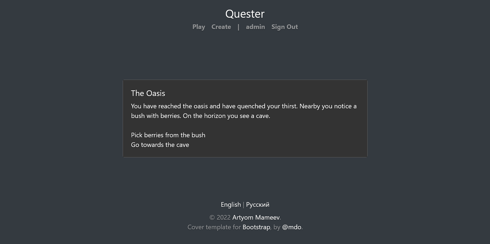](https://github.com/artyom-mameev/quester/blob/master/readme/screenshots/2-for-preview-3-full.png?raw=true)  
[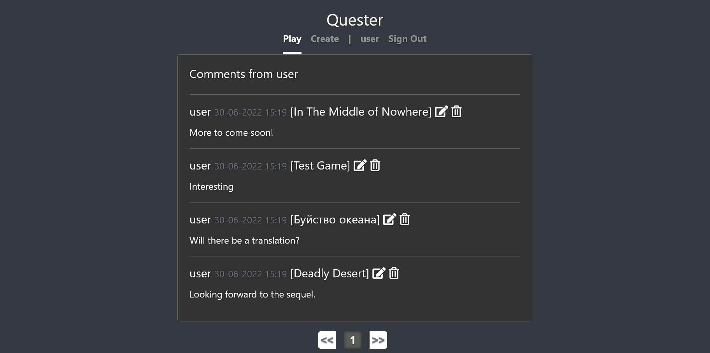](https://github.com/artyom-mameev/quester/blob/master/readme/screenshots/2-for-preview-4-full.png?raw=true) [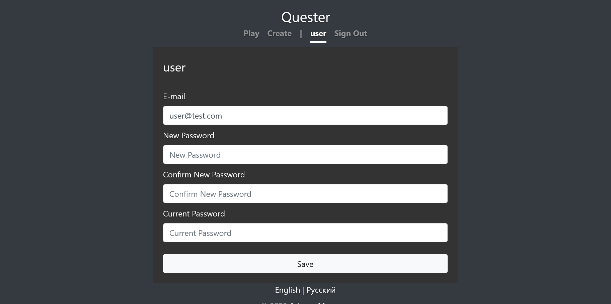](https://github.com/artyom-mameev/quester/blob/master/readme/screenshots/2-for-preview-5-full.png?raw=true) [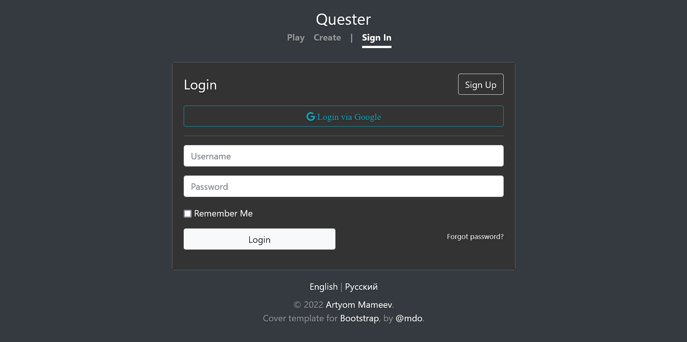](https://github.com/artyom-mameev/quester/blob/master/readme/screenshots/2-for-preview-6-full.png?raw=true)  
[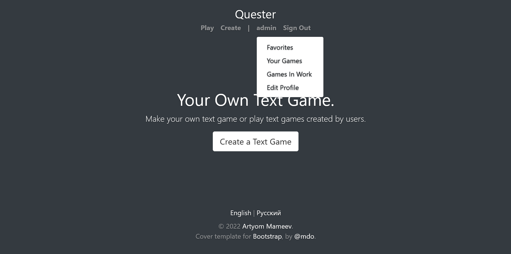](https://github.com/artyom-mameev/quester/blob/master/readme/screenshots/2-for-preview-7-full.png?raw=true) [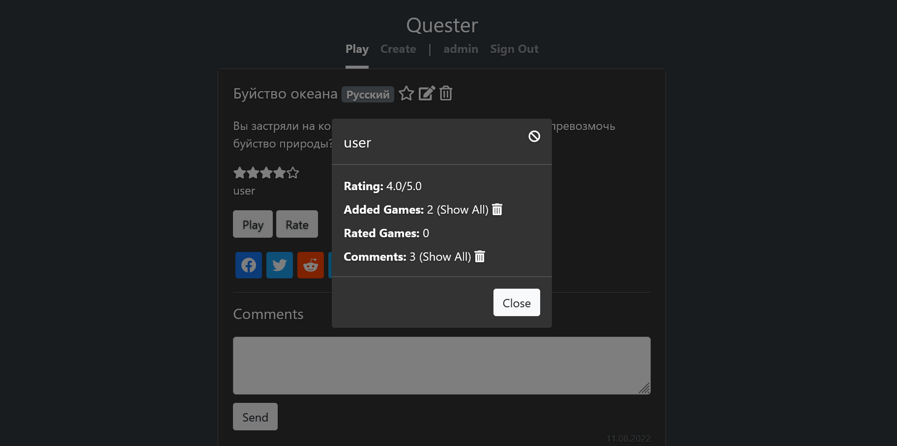](https://github.com/artyom-mameev/quester/blob/master/readme/screenshots/2-for-preview-8-full.png?raw=true) [](https://github.com/artyom-mameev/quester/blob/master/readme/screenshots/2-for-preview-9-full.png?raw=true)

<a name="architecture"/>

## Architecture

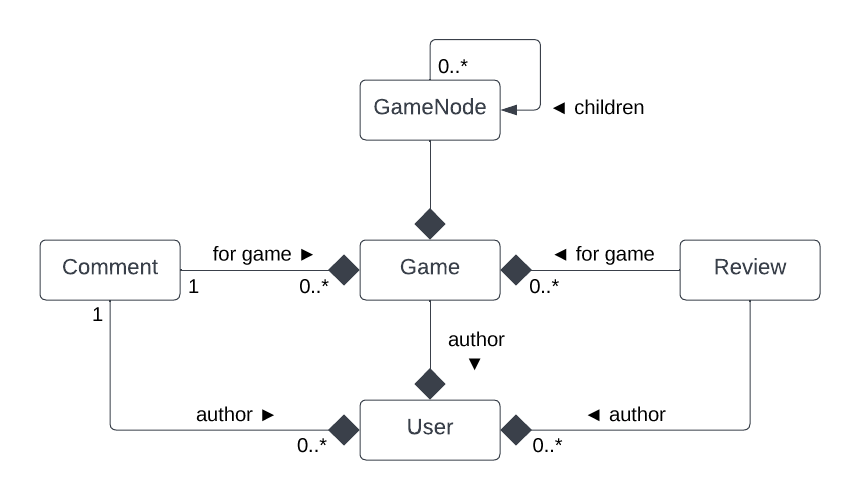
<sup>An entity relationship diagram</sup>

- A clean package structure, with classes organized by purpose, area of
  responsibility, and level of abstraction;
- Unified operations on regular users and oAuth2 users using a special
  abstraction;
- Using AOP to avoid the boilerplate operation of adding the current user object
  to the Spring MVC model;
- The layers of controllers, services, repositories and business objects are
  separated according to the principles of separation of concerns and loose
  coupling - each level handles only its own tasks and delegates other tasks to
  appropriate levels;
- A focus on generally accepted good coding principles and design patterns (for
  example, to implement a complex tree structure of game elements, the
  advantages of the "composite" pattern were used, which allowed to conveniently
  manage the elements using recursive search algorithms);
- Following encapsulation principles to provide convenient and secure
  interfaces;
- To protect data integrity, interfaces mostly return immutable objects to the
  client;
- The validation mechanism for user input is separated and implemented using
  Java Bean Validation;
- Data integrity validation for complex objects is a part of the business
  logic (which allows not to open their internals to external validators), user
  errors generating unchecked exceptions that wraps into other exceptions
  depending on the level of abstraction, and once the controller level is
  reached a low-level exception generates, then handles by an external handler
  that answers the client request with the appropriate error with the root cause
  text of the exception. This allowed to separate the user error handling from
  the corresponding levels and focus solely on the logic corresponding to the
  particular level of abstraction;
- REST API controllers and dynamic page content controllers are separated and
  can function self-sufficiently;
- REST APIs are not strictly bound to the frontend and can be effectively used
  to implement third-party clients that implement certain aspects of a service's
  functionality (e.g., third-party game constructors);
- Access conditions to certain pages and API endpoints were separated into
  Spring Security filters (for example, a mechanism that denies access to the
  login or registration page for users who are already authenticated, a
  mechanism that adds the necessary path variables to URLs if they are missing,
  etc.), all exceptions related to access conditions and authentication are
  handled exclusively at the Spring Security level;
- The JavaScript code is split into "pseudo-modules" by splitting them into
  separate files according to the principles of separation of concerns and
  better testability;
- Use of Thymeleaf fragments to reuse static page content.

<a name="style"/>

## Code style

- Focus to write simple and readable code;
- Simple and meaningful names of classes, methods and variables, separation of
  different aspects of functionality in separate methods;
- The code is accompanied by documentation, with complex points accompanied by
  comments;
- Division of complex code constructs into several primitive parts for better
  understanding;
- Limiting the number of characters by line width for better readability;
- Diverse operations are separated by indents;
- Avoiding "spaghetti code" (nested ifs);
- Using Lombok to avoid boilerplate code.

<a name="data"/>

## Data storage

- When designing the ORM model, a special attention was paid to usability and
  flexibility of relationships between entities, so that operations have a
  high-level nature and interaction with the entities is almost no different
  from working with regular Java objects;
- To ensure data security and integrity, the ORM model is carefully accompanied
  by the necessary constraints;
- In order to optimize, the ORM model carefully specified the most effective
  collection loading strategies depending on the business logic requirements;
- The technology of generating database queries from CRUD repository method
  names has been used, allowing queries to be edited by simply refactoring the
  methods names;
- Pagination at the CRUD repository level;
- Game and user ratings are calculated using a special SQL trigger.

<a name="textgame"/>

## Text game format

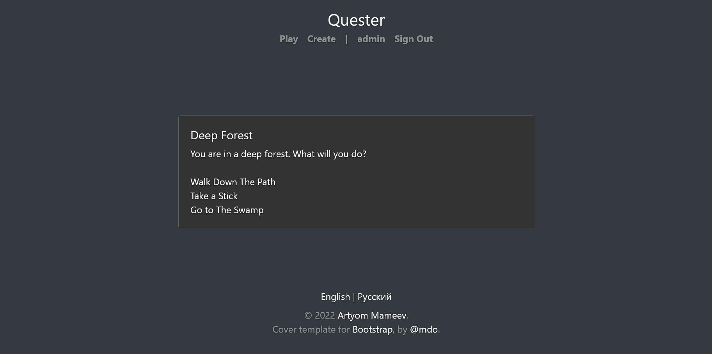

During the game, a room is shown to the player, depending on which the player is
asked to make a particular choice that lead to another room. The game rooms may
also contain actions, depending on which new choices may appear and routes to
new rooms become available. The goal of the player is to reach the room which is
presented by the author of the game as the final room, and to avoid the rooms
which are presented as dead ends. There can be several final rooms - the player
can start the game all over again and achieve a different result.

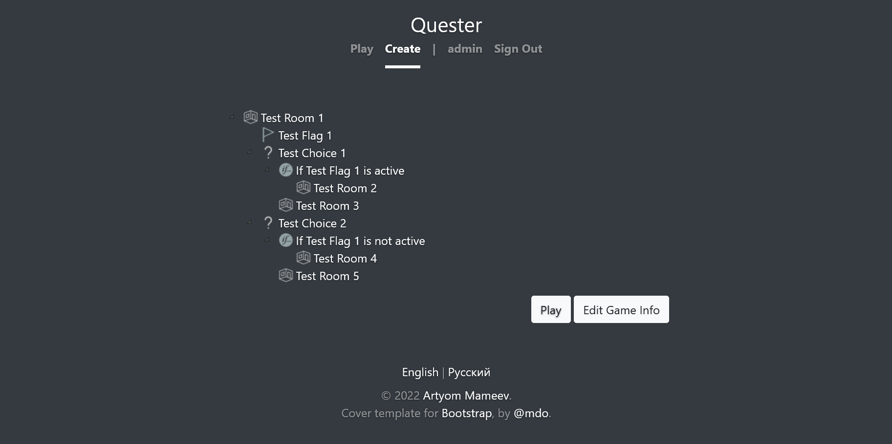

Architecturally, games are built from a special game elements, which form a
tree-like structure. Each node of the structure is a separate game element,
which can contain other game elements.

### Room


Has a name and a description. Can contain *choices* or actions (*flags*).

### Choice


Has a name. Can contain a *room* to which the choice leads, or the *conditions*.

### Flag


Has a name. An action that can trigger one or several *conditions*. Cannot
contain any other game elements.

### Condition


A condition that can be triggered depending on the state of a particular *flag*.
Can contain a *room* to which the *choice* containing the condition should lead,
or other *conditions* (a chain of *conditions* can be implemented in that way).

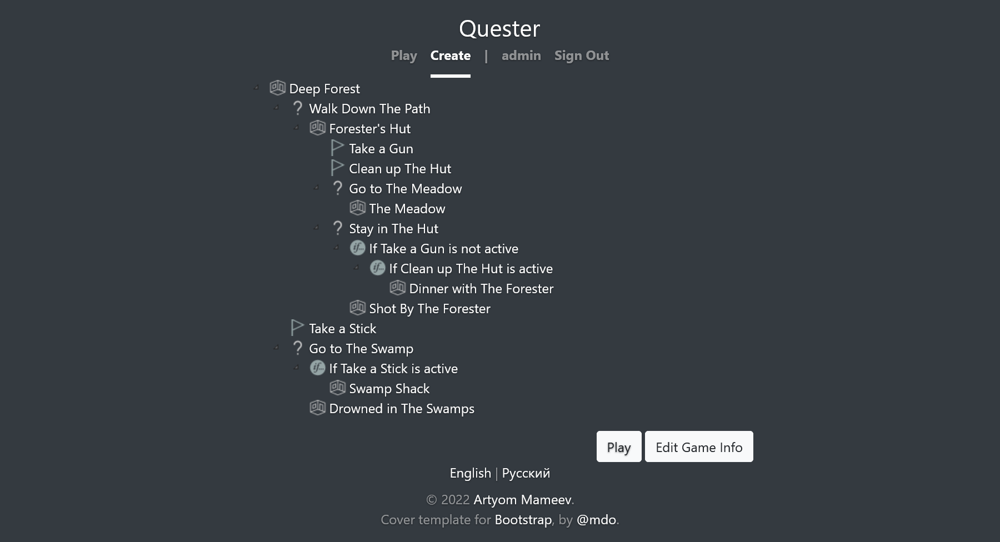

- A root node of game elements can only be a *room*;
- A *choice* can contain only one *room*;
- If a *choice* contains a *room* and one or more *conditions* leading to
  other *rooms*, if no *conditions* are triggered, the *choice* leads directly
  to the *room* contained in the *choice*, otherwise the *choice* leads to the 
  *room* contained in the *condition* that was triggered. In this way, it is
  possible to create multiple *conditions* for getting into specific *rooms*,
  and a default *room* that the player will get into if none of the *conditions*
  are triggered. For example, see the picture above: The "Go to The Swamp" 
  *choice* contains the "If Take a Stick is active" *condition* and the "Drowned
  in The Swamps" *room*. If the player has activated the "Take a Stick" *flag*
  and thus triggered the "If Take a Stick is active" *condition*, that *choice*
  will lead to the *room* contained in the "If Take a Stick is active" 
  *condition* - that is, the "Swamp Shack" *room*. If the "Take a Stick" *flag*
  has not been activated by the player, and therefore the "If Take a Stick is
  active" *condition* has not been triggered, the *choice* will lead to the 
  "Drowned in The Swamps" *room*;
- If a *choice* contains more than one triggered *conditions*, the first 
  *condition* added will take priority;
- If a *choice* does not contain any *room*, or it contains only one or more 
  *conditions* that also do not contain a *room* or they have not been triggered,
  that *choice* will not show up;
- If the player enters a *room* that has no *choices*, or no *choice* is shown
  in the *room* because it does not contain a *room*, or contains one or more
  untriggered *conditions*, the game is considered over;
- A *flag* can trigger *conditions* that are behind the *choice* in the
  current *room*. Suppose a *room* contains a *flag* and a *choice* containing
  a *condition* that is triggered by that *flag*. As long as the player has not
  activated that *flag*, the *choice* containing the *condition* will therefore
  not be shown, and only the *flag* will be shown to the player in that room.
  But once the player activates that *flag*, if that *choice* with the now
  triggered *condition* leads to any *room* or contains a triggered *condition*
  or a chain of triggered *conditions* leading to any *room*, that *choice* will
  appear in the current *room* (in this way, it is possible to create a chain of
  actions that must be done in order for a new *choice* to appear in the
  current *room*.)

<a name="getting-started"/>

## Getting started

Java 11 or above is required.

### Run

```bash
mvnw clean spring-boot:run
```

Then navigate to http://localhost:8080/.

To open the H2 Database Console, navigate to http://localhost:8080/h2-console.

### Build

```bash
mvnw clean package
```

File should be created at: target\quester-0.0.1-SNAPSHOT.jar

### Run tests

```bash
mvnw clean test
```

#### Authentication details

##### Test admin user

Username: `admin`  
Password: `testpassword`

##### Test normal user

Username: `user`  
Password: `testpassword`

#### The database configuration and authentication details are located in the application.yml file.

```yaml
  datasource:
    url: 'jdbc:h2:mem:testdb'
    username: sa
    data: 'classpath:/sql/triggers.sql'
```

#### To enable oAuth2 authorization with Google, you need to [create a new project in Google Developers  Console](https://www.balbooa.com/gridbox-documentation/how-to-get-google-client-id-and-client-secret) and add your `cliend ID` and `client secret` to the application.yml file.

```yaml
  security:
    oauth2:
      client:
        registration:
          google:
            client-id: your cliend id
            client-secret: your client secret
```

<a name="todo"/>

## TODO

- [ ] Write integration tests for the dynamic content generated by the Thymeleaf
  processor.
- [ ] Write integration tests for the user input validation.
- [ ] Fully document the JavaScript code.

<a name="license"/>

## License

Copyright ©2022 Artyom Mameev.  
Licensed under the [MIT License](https://opensource.org/licenses/MIT).

[luckmoshypagnation.js](https://www.jqueryscript.net/other/luckmoshy-bootstrap-pagination.html)
is licensed under the [MIT License](https://opensource.org/licenses/MIT).  
[jQuery Rating.js](https://github.com/timyboy12345/Rating.js) is licensed under
the [MIT License](https://opensource.org/licenses/MIT).  
[Shareon.js](https://github.com/kytta/shareon) is licensed under
the [MIT License](https://opensource.org/licenses/MIT).

`EmailChecker` code was taken
from [Spring Boot in Action Sample Code](https://github.com/habuma/spring-boot-in-action-samples)
which licensed under
the [Apache License](https://www.apache.org/licenses/LICENSE-2.0).

Cover template for Bootstrap by [mdo](https://twitter.com/mdo).

[Room](https://icons8.com/icon/110119/комната)
, [Question Mark](https://icons8.com/icon/85935/вопросительный-знак)
, [Flag](https://icons8.com/icon/11710/флаг)
and [Condition](https://icons8.com/icon/XZ90flS6EmrA/if) icons
by [Icons8](https://icons8.com).

<a name="contribution"/>

## Contribution

Any contributions to the project are welcome.